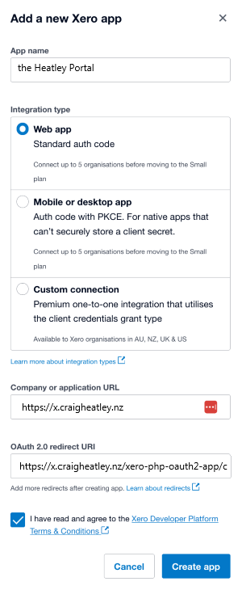
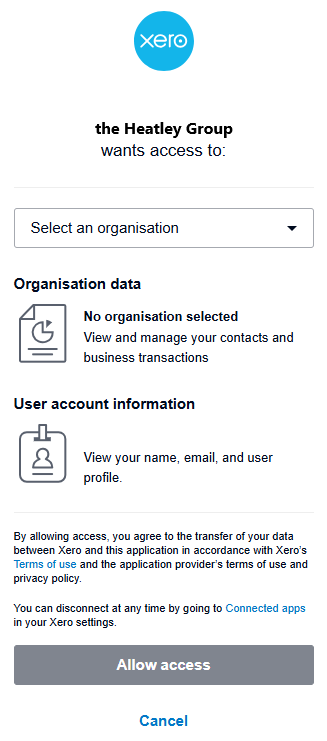

# Connecting to Xero

> Follow the instructions below to give the Heatley Portal permission to access your Xero account via the Xero API.

> To connect the Heatley Portal to your Xero account you need to have the 'User with Xero' role in the Heatley Portal. If you can't see the "Add Xero Authentication Credentials" button on your Profile page, please contact us to upgrade.

To connect the Heatley Portal to your Xero account you must do two things:

1.  Create an “App” in Xero
2.  Save the Client ID and Client Secret from the App into the Heatley Portal

### In Xero

*   Login to the Xero developer center with your Xero login [https://developer.xero.com/myapps](https://developer.xero.com/myapps)
*   Click "New App"

*   Enter "the Heatley Portal" as the App name and choose the Web app option.
*   Enter "https://x.craigheatley.nz" in the Company or application URL field.
*   Enter “https://x.craigheatley.nz/xero-php-oauth2-app/callback.php” in the Redirect URI field.
*   Agree to terms and conditions and click "Create App".
*   Go to the Configuration page and click "Generate a secret" button, but don't hit save otherwise the secret will disappear.

*   Copy your client id and client secret so you can enter the values in the Heatley Portal.
*   Click the "Save" button. You secret is now hidden.
*   Leave the "Login URL for launcher" field empty.
*   Click on the "Save" button.

### In the Heatley Portal:

*   Go to Profile tab
*   Click on the Add Xero Authentication Credentials button

*   Enter the Client id and Client secret into the fields.
*   Click "Save".

* Click on the 'Connect to Xero' button to log into Xero.
* Log in with your usual username and password.

* Select your organisation and click 'Allow access'.
* You can now view Xero invoices, bills and more!
