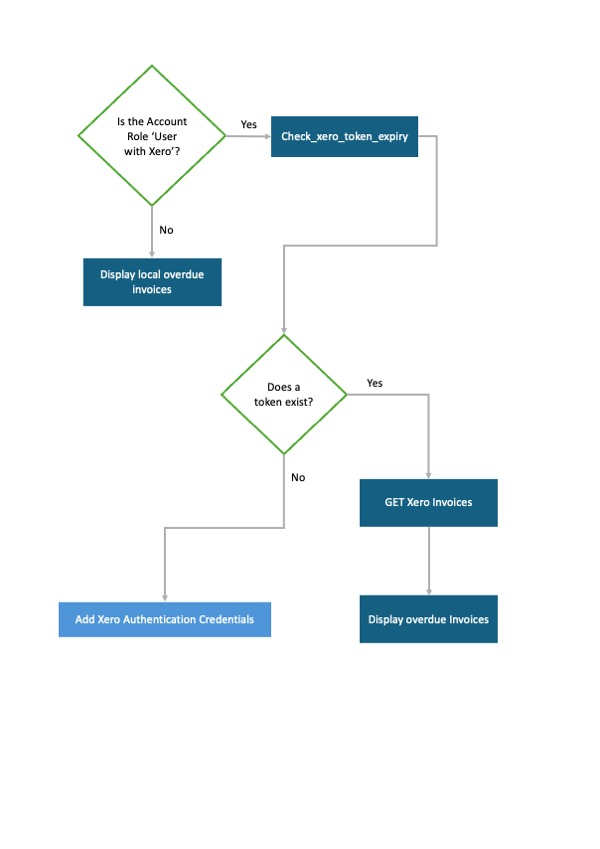

# Home page Xero workflow

> How the system decides what is displayed on the home page in the Overdue Invoices panel.

* If the user does <b>not</b> have the 'User with Xero' role, they will see the invoices saved in LeaseManager.
* If they have the 'User with Xero' role but there is no Xero Authentication record, they will see the button to add a new Xero Authentication.
* If there is a Xero Authentication record, run the function to check the expiry, update the token if necessary and display the overdue invoices from the company's Xero account.

> NOTE: When the user first logs in and views the home page, it may take more than 30 seconds to get the invoice records from Xero which will cause a time-out error.

